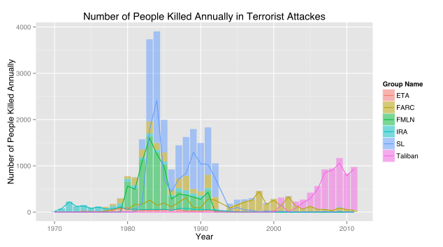
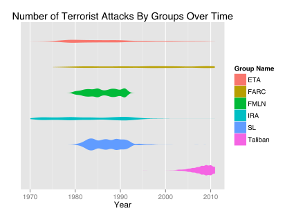
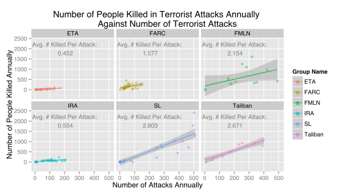

Assignment 6 (Currently been modified on Nov 2)
========================================================

These terrorist groups are the top 6 ranked by the total number of terrorist attacks they organized over the years.
<!-- html table generated in R 3.0.2 by xtable 1.7-1 package -->
<!-- Sat Nov  2 20:53:01 2013 -->
<TABLE border=1>
<TR> <TH>  </TH> <TH> Group Name </TH> <TH> Total Events </TH> <TH> Total Killed </TH>  </TR>
  <TR> <TD align="right"> 1 </TD> <TD> Shining Path (SL) </TD> <TD align="right"> 4518 </TD> <TD align="right"> 11570 </TD> </TR>
  <TR> <TD align="right"> 2 </TD> <TD> Farabundo Marti National Liberation Front (FMLN) </TD> <TD align="right"> 3351 </TD> <TD align="right"> 8065 </TD> </TR>
  <TR> <TD align="right"> 3 </TD> <TD> Irish Republican Army (IRA) </TD> <TD align="right"> 2673 </TD> <TD align="right"> 1809 </TD> </TR>
  <TR> <TD align="right"> 4 </TD> <TD> Revolutionary Armed Forces of Colombia (FARC) </TD> <TD align="right"> 2045 </TD> <TD align="right"> 5240 </TD> </TR>
  <TR> <TD align="right"> 5 </TD> <TD> Taliban </TD> <TD align="right"> 2030 </TD> <TD align="right"> 5770 </TD> </TR>
  <TR> <TD align="right"> 6 </TD> <TD> Basque Fatherland and Freedom (ETA) </TD> <TD align="right"> 2027 </TD> <TD align="right"> 818 </TD> </TR>
   </TABLE>

### The Rises and Falls Some of the Most Active Terrorist Group in History

